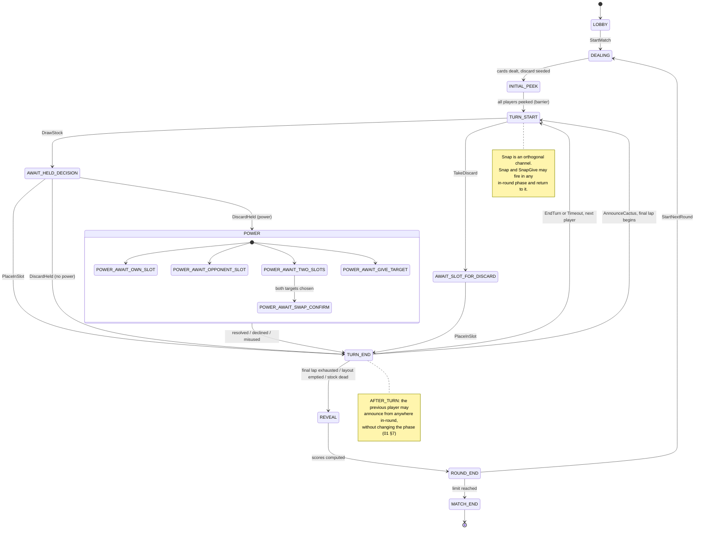

# 04 — State Machine

Phases, guards, and transitions. The types are in
[03-domain-model.md](03-domain-model.md); the code behind each transition is in
[05](05-engine-core.md), [06](06-powers.md) and [07](07-snap.md).

---

## 1. The two-channel model

The single most important structural decision in this spec:

> **The turn is a state machine. The snap is not.**

A turn is a strict sequence: choose a source, resolve it, maybe resolve a power,
end. That is a phase machine.

A **snap** can fire from any player, at any instant, in almost any phase. Modelling
it as a phase would mean duplicating the whole turn machine for "…but a snap is in
progress". Instead it is an **orthogonal channel**, gated not by phase or turn
order but by two pieces of state:

- `discardVersion` — which snap window the action is reacting to;
- `lockedSlots` — which slots are currently untouchable because a swap is in
  flight.

The only phase snap introduces is `AWAIT_SNAP_GIVE`, and only when
`cfg.snap.allowOnOpponent` is on — because *that* branch genuinely requires an
extra decision from the snapper. Everything else about snapping resolves in one
step and returns to whatever phase was current.

Likewise, **the final lap is not a phase**. `finalLapRemaining` is a counter
overlaid on the ordinary turn phases; only the round-end condition changes. See
[03 §5](03-domain-model.md#5-game-state).

## 2. Phase diagram

## 3. Transition table

`P` = the acting player. `C` = the current player (`turnOrder[currentPlayerIndex]`).
`O` = `pendingPower.ownerId`, which is `C` for every power the drawn card earned and
somebody else for a power a snap earned ([06 §10](06-powers.md)). `resumePhase` is
null except in that case, so `resumePhase ?? TURN_END` reads as `TURN_END`
everywhere else.
Guards that fail produce `ActionRejected` and **no state change** — rejection is a
normal outcome, not an error ([README](README.md)).

| Phase | Action | Guard | → Phase | Events |
|-------|--------|-------|---------|--------|
| `LOBBY` | `LobbyJoin` | room not full, match not started | `LOBBY` | `ConnectionChanged` |
| `LOBBY` | `LobbyLeave` | P in room | `LOBBY` | `ConnectionChanged` |
| `LOBBY` | `StartMatch` | P is host, ≥ 2 players | `DEALING` | `MatchStarted` |
| `DEALING` | *(none — engine-driven)* | — | `INITIAL_PEEK` | `RoundStarted`, `CardsDealt`, `DiscardSeeded` |
| `INITIAL_PEEK` | `PeekInitial` | `!P.hasPeeked`, `len(slots) == cfg.deck.initialPeekCount`, slots legal per `cfg.deck.initialPeekFree` | `INITIAL_PEEK`, or `TURN_START` when **all** have peeked | `InitialPeeked`, then `AllPeeked` + `TurnStarted` |
| `INITIAL_PEEK` | `Timeout` | token fresh, window `cfg.timing.initialPeekMs` elapsed | `TURN_START` | `AllPeeked`, `TurnStarted` |
| `TURN_START` | `DrawStock` | `P == C`, stock non-empty **or** refillable | `AWAIT_HELD_DECISION` | `StockReshuffled`?, `StockDrawn` |
| `TURN_START` | `TakeDiscard` | `P == C`, discard non-empty | `AWAIT_SLOT_FOR_DISCARD` | `DiscardTaken` |
| `TURN_START` | `AnnounceCactus` | `P == C`, `cfg.announce.timing == INSTEAD_OF_TURN`, no announcer yet | `TURN_END` | `CactusAnnounced` |
| `TURN_START` | `Timeout` | token fresh | `AWAIT_HELD_DECISION` | auto `DrawStock` (see [05](05-engine-core.md)) |
| `AWAIT_HELD_DECISION` | `PlaceInSlot` | `P == C`, slot in range, slot not in `lockedSlots` | `TURN_END` | `CardPlaced` |
| `AWAIT_HELD_DECISION` | `DiscardHeld` | `P == C` | `TURN_END` if `powerFor(held) == NONE` else the matching `POWER_*` | `HeldDiscarded`, `PowerStarted`? |
| `AWAIT_HELD_DECISION` | `Timeout` | token fresh | as `DiscardHeld` with `PowerSkip` | `HeldDiscarded`, `PowerDeclined`? |
| `AWAIT_SLOT_FOR_DISCARD` | `PlaceInSlot` | `P == C`, slot in range, not locked | `TURN_END` | `CardPlaced` |
| `AWAIT_SLOT_FOR_DISCARD` | `Timeout` | token fresh | `TURN_END` | `CardPlaced` into the first legal slot |
| `POWER_AWAIT_OWN_SLOT` | `PowerTarget` | `P == O`, `target.playerId == P`, slot non-`EMPTY`, not locked | `resumePhase ?? TURN_END` | `CardRevealed` |
| `POWER_AWAIT_OPPONENT_SLOT` | `PowerTarget` | `P == O`, `target.playerId != P`, slot non-`EMPTY`, not locked | `resumePhase ?? TURN_END` | `CardRevealed` |
| `POWER_AWAIT_TWO_SLOTS` | `PowerTarget` | first target own, second an opponent's; both non-`EMPTY`, not locked | same phase, then `POWER_AWAIT_SWAP_CONFIRM` | `CardRevealed` |
| `POWER_AWAIT_SWAP_CONFIRM` | `PowerConfirmSwap` | `P == O` | `resumePhase ?? TURN_END` | `CardsSwapped`? |
| `POWER_AWAIT_GIVE_TARGET` | `PowerTarget` | `P == O`, `target.playerId != P`, `cfg.powers.aceGiveEnabled` | `resumePhase ?? TURN_END` | `CardGiven` |
| any `POWER_*` | `PowerSkip` | `P == O` | `resumePhase ?? TURN_END` | `PowerDeclined` |
| any `POWER_*` | `PowerTarget` **illegal** | guard failed | `resumePhase ?? TURN_END` | `PenaltyCardTaken(reason: POWER_MISUSE)` |
| any `POWER_*` | `Timeout` | token fresh | `resumePhase ?? TURN_END` | `PowerDeclined` |
| `TURN_END` | `AnnounceCactus` | `P == C`, `cfg.announce.timing != INSTEAD_OF_TURN`, no announcer yet | `TURN_START` (next player) | `CactusAnnounced`, `TurnEnded`, `TurnStarted` |
| **in-round\***, not `P`'s turn | `AnnounceCactus` | `cfg.announce.timing == AFTER_TURN`, `P == previousPlayerId`, `P` active, no announcer yet | **unchanged** — the current player keeps their turn | `CactusAnnounced` |
| `TURN_END` | `EndTurn` | `P == C` | `TURN_START`, or `REVEAL` if round-over | `TurnEnded`, `FinalLapAdvanced`?, `TurnStarted` \| `RoundRevealed` |
| `TURN_END` | `Timeout` | token fresh, window `cfg.timing.endOfTurnWindowMs` | as `EndTurn` | same |
| **in-round\*** | `Snap` | see [07](07-snap.md) | unchanged, or `AWAIT_SNAP_GIVE`, or `REVEAL`, or a `POWER_*` when `cfg.powers.onHandDiscard` | `SnapSucceeded` \| `SnapFailed`, `SlotEmptied`?, `PenaltyCardTaken`?, `PowerStarted`? |
| `AWAIT_SNAP_GIVE` | `SnapGive` | P is the snapper, slot own and non-`EMPTY` | the phase that was current before the snap | `CardGiven` |
| `AWAIT_SNAP_GIVE` | `Timeout` | token fresh | previous phase | `CardGiven` (first legal slot) |
| `REVEAL` | *(none — engine-driven)* | — | `ROUND_END` | `RoundScored` |
| `ROUND_END` | `StartNextRound` | P is host, `!isMatchOver` | `DEALING` | `RoundStarted` |
| `ROUND_END` | *(engine)* | `isMatchOver` | `MATCH_END` | `MatchEnded` |
| any | `LobbyLeave` | P in match | unchanged | `ConnectionChanged` |
| any | stale `Timeout` | `phaseToken != actionCounter` | unchanged | *(silently dropped)* |
| any | anything else | — | unchanged | `ActionRejected` |

\* **in-round** = `TURN_START`, `AWAIT_HELD_DECISION`, `AWAIT_SLOT_FOR_DISCARD`,
all `POWER_*`, `TURN_END`. Snap is **not** legal in `LOBBY`, `DEALING`,
`INITIAL_PEEK`, `REVEAL`, `ROUND_END`, `MATCH_END`, and is disabled entirely when
`cfg.snap.enabled == false`.

**Snap, the late announcement and a power a snap earned are the actions a player
may take while it is not their turn** — the rows above whose guard is not `P == C`.
The first two leave the phase alone. The third does not: it takes the phase, and
`resumePhase` gives it back, which is the same bargain `AWAIT_SNAP_GIVE` strikes.

### Action coverage

All 17 members of the `Action` union appear above:
`LobbyJoin`, `LobbyLeave`, `StartMatch`, `PeekInitial`, `DrawStock`,
`TakeDiscard`, `PlaceInSlot`, `DiscardHeld`, `PowerSkip`, `PowerTarget`,
`PowerConfirmSwap`, `Snap`, `SnapGive`, `AnnounceCactus`, `EndTurn`,
`StartNextRound`, `Timeout`.

## 4. Phase invariants

Checked after every reduction ([11](11-edge-cases-and-invariants.md) has the full
list):

| Phase | Must hold |
|-------|-----------|
| `LOBBY` | `heldCard == null`, `pendingPower == null`, all layouts empty |
| `INITIAL_PEEK` | every layout has exactly `cfg.deck.handSize` non-`EMPTY` slots |
| `TURN_START` | `heldCard == null`, `pendingPower == null` |
| `AWAIT_HELD_DECISION` | `heldCard != null`, `pendingPower == null` |
| `AWAIT_SLOT_FOR_DISCARD` | `heldCard != null` (it came off the discard), `pendingPower == null` |
| `POWER_*` | `pendingPower != null`; `heldCard == null` unless `resumePhase` says the interrupted phase was holding one |
| `AWAIT_SNAP_GIVE` | `pendingSnapGive != null` and names the snapper and the victim; `resumePhase != null` |
| `TURN_END` | `heldCard == null`, `pendingPower == null` |
| `REVEAL` | every player's `roundScore == null` on entry, non-null on exit |
| `MATCH_END` | no further action changes state except `LobbyLeave` |

## 5. Round-over conditions

`TURN_END` (and a successful snap) must check, in this order:

1. **Layout emptied** — a player has no non-`EMPTY` slots and
   `cfg.snap.emptyLayoutEndsRound` → `REVEAL` immediately.
2. **Final lap exhausted** — `finalLapRemaining == 0` → `REVEAL`.
3. **Stock dead** — stock empty and not refillable
   (`cfg.deck.reshuffleDiscard == false`, or the discard holds only its top card)
   → `REVEAL`.
4. Otherwise → advance to the next player, `TURN_START`.

The order matters: an emptied layout beats an in-flight final lap, because the
emptying player has provably finished at 0.
